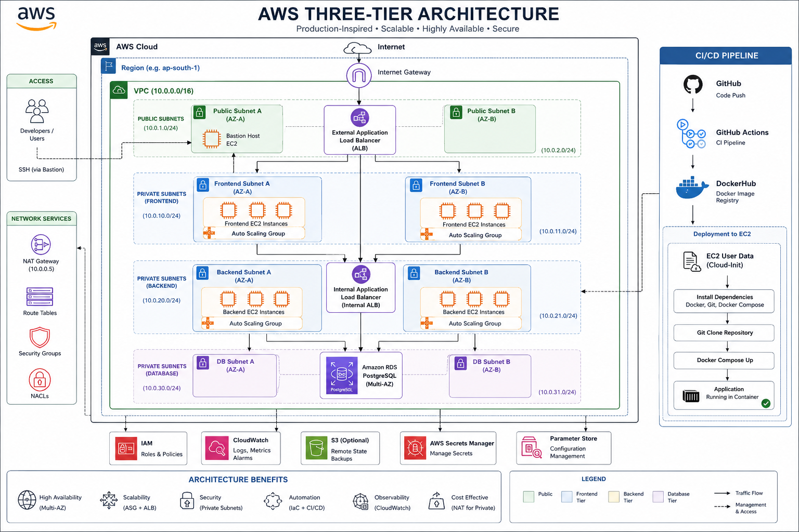

<div align="center">

# ☁️ AWS Three-Tier Architecture

### Production-Inspired Infrastructure on AWS using Terraform, Docker, Kubernetes (k3s) & GitHub Actions


Production-inspired AWS Infrastructure demonstrating Infrastructure as Code, CI/CD, Docker image automation, Kubernetes deployments and scalable cloud architecture.

</div>

---

# 📖 Overview

This project demonstrates how a production-inspired cloud infrastructure can be designed, deployed and managed entirely through Infrastructure as Code.

Rather than creating isolated AWS resources, the objective was to understand how networking, compute, security, automation, databases and deployment pipelines work together as a complete platform.

The infrastructure provisions an end-to-end AWS environment capable of automatically deploying containerized applications using Terraform, GitHub Actions, Kubernetes (k3s) and EC2 User Data.

---

# 🎯 Why I Built This

The primary objective of this project was to move beyond learning individual AWS services and instead understand how production systems are actually engineered.

This repository focuses on:

- Infrastructure as Code
- Production Networking
- Automation
- CI/CD
- Kubernetes Deployments
- Docker Image Management
- High Availability
- Cloud Debugging
- Infrastructure Troubleshooting

The goal wasn't simply making Terraform work.

The goal was understanding **why production infrastructure is designed the way it is.**

---

# ⭐ Highlights

- Built entirely using Terraform
- Production-inspired AWS Networking
- Infrastructure as Code
- Self-managed Multi-Node Kubernetes (k3s) Cluster
- Docker Image Pipeline
- GitHub Actions CI/CD
- Dedicated Kubernetes Control Plane
- Auto Scaling Worker Nodes
- External Application Load Balancer
- Kubernetes Ingress
- Amazon RDS PostgreSQL
- Redis StatefulSet
- CloudWatch Monitoring
- Remote Terraform State
- Automated EC2 Bootstrapping using User Data
- SSM-based Cluster Join Automation
- Separate Frontend & Backend Deployments
- Namespace Isolation
- Resource Requests & Limits
- Liveness & Readiness Probes

---

# 🏗 Architecture

```
                 Internet
                     │
                     ▼
      External Application Load Balancer
                     │
                     ▼
            Kubernetes Ingress
                     │
                     ▼
     Multi-Node Kubernetes (k3s) Cluster
                     │
        ┌────────────┴────────────┐
        ▼                         ▼
 Frontend Deployment      Backend Deployment
        │                         │
        └───────────┬─────────────┘
                    ▼
            Redis StatefulSet
                    │
                    ▼
         Amazon RDS PostgreSQL
```

# ☁ Infrastructure Components

| Service | Purpose |
|----------|----------|
| VPC | Network Isolation |
| Public Subnets | Load Balancer & Bastion |
| Application Subnets | Worker Nodes |
| Database Subnets | PostgreSQL |
| Internet Gateway | Public Connectivity |
| NAT Gateway | Private Internet Access |
| Security Groups | Network Security |
| Bastion Host | Secure SSH |
| External ALB | Public Entry |
| Control Plane | Kubernetes API |
| Worker ASG | Kubernetes Workers |
| IAM | Secure AWS Permissions |
| SSM Parameter Store | Cluster Join Token |
| RDS PostgreSQL | Database |
| Redis | Cache |
| Kubernetes | Orchestration |
| Ingress | Traffic Routing |
| ConfigMaps | Runtime Config |

---

# 🚀 Features

- Infrastructure as Code
- Automated Infrastructure Provisioning
- Self-managed Kubernetes Cluster
- Auto Scaling Workers
- Docker Image Automation
- GitHub Actions CI/CD
- Kubernetes Ingress
- Frontend & Backend Deployments
- Redis StatefulSet
- PostgreSQL
- ConfigMaps
- Namespace Isolation
- Health Checks
- CloudWatch Monitoring

---

# 🛠 Technology Stack

| Category | Technologies |
|------------|----------------|
| Cloud | AWS |
| IaC | Terraform |
| Programming | Python |
| Containers | Docker |
| Orchestration | Kubernetes (k3s) |
| CI/CD | GitHub Actions |
| Database | PostgreSQL, Redis |
| Networking | VPC, ALB, Ingress |
| Monitoring | CloudWatch |

---

# 📂 Repository Structure

```
aws-three-tier-architecture/

├── .github/
│   └── workflows/

├── docs/
│   ├── architecture.md
│   ├── deployment_notes.md
│   ├── design-decisions.md
│   ├── lessons_learned.md
│   └── roadmap.md

├── Backend/
     ├── app.py
     ├── requirement.txt
     └── Dockerfile

├── Frontend/
     ├── app.py
     ├── requirement.txt
     └── Dockerfile


├── kubernetes-files/
│   ├── base/
│   ├── backend/
│   ├── frontend/
│   ├── redis/
│   └── ingress.yaml

├── images/
│   └── architecture.png

├── terraform_infra/
│   └── scripts/

├── docker-compose.yml

├── README.md

└── LICENSE
```

---

# 🚧 Roadmap

## ✅ Version 1
- Terraform
- Docker
- GitHub Actions
- ALB
- RDS

## ✅ Version 2
- Kubernetes
- StatefulSets
- ConfigMaps
- Namespace
- Health Probes

## ✅ Version 2.1
- Ingress

## ✅ Version 3
- Single Multi-node Cluster
- Control Plane
- Worker ASG
- SSM Cluster Join
- Separate Frontend & Backend
- Internal Service Discovery

## 🚀 Future
- Prometheus
- Grafana
- EKS
- ArgoCD
- HPA
- Metrics Server
- Cluster Autoscaler
- Centralized Logging

---

## Architecture

<p align="center">



</p>

---

## 🤝 Acknowledgements

The initial AWS architecture was inspired by publicly available cloud architecture tutorials. The Kubernetes architecture, automation, debugging, design decisions and production evolution represent my own implementation.

---

## Thanks for visiting my project! ⭐